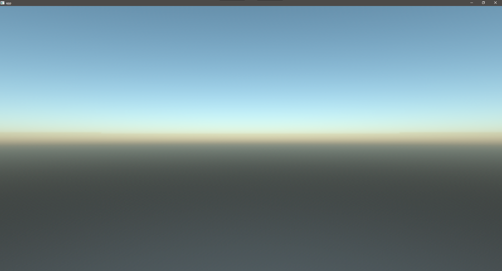
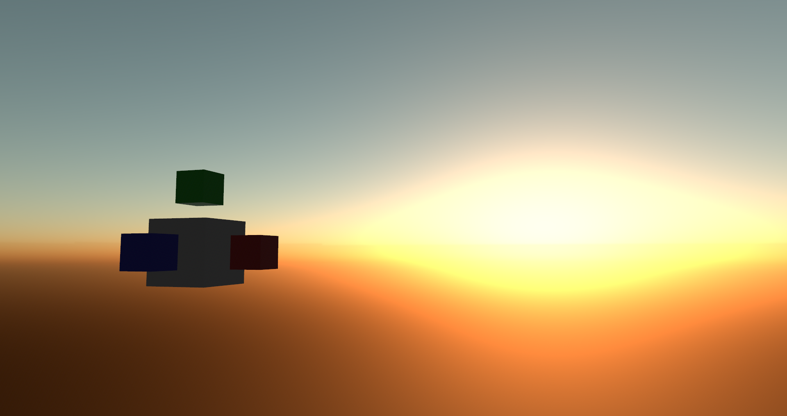

# [](https://github.com/JonahPlusPlus/bevy_atmosphere)
[](https://crates.io/crates/bevy/0.9.0)
[](https://crates.io/crates/bevy_atmosphere)
[](https://crates.io/crates/bevy_atmosphere)
[](https://docs.rs/bevy_atmosphere/)
[](https://github.com/JonahPlusPlus/bevy_atmosphere#license)
[](https://discord.com/channels/691052431525675048/1035260359952576603)

A procedural sky plugin for the [Bevy game engine](https://bevyengine.org/).

## ["basic" Example](/examples/basic.rs)



```rust
use bevy::prelude::*;
use bevy_atmosphere::prelude::*;

fn main() {
    App::new()
        .add_plugins(DefaultPlugins)
        .add_plugin(AtmospherePlugin)
        .add_startup_system(setup)
        .run();
}

fn setup(mut commands: Commands) {
    commands.spawn((Camera3dBundle::default(), AtmosphereCamera::default()));
}
```

## ["cycle" Example](/examples/cycle.rs)



## Getting Started

To learn more, read the [docs](https://docs.rs/bevy_atmosphere/) or check out the [examples](/examples/).

### 🚧 Warning: Under Development 🚧

Versions 0.4 and higher break compatibility with WebGL by using a compute shader for efficiency.
WebGPU should resolve this when shipped.

If you need to test a web build, you can try enabling your browser's respective experiment flag for WebGPU.

## License

bevy_atmosphere is dual-licensed under MIT and Apache-2.0! That means you can choose to use `bevy_atmosphere` under either for your project.

## 0.5 Change Log

- Removed the `Atmosphere` resource in favor of the `Nishita` model.
- Added the `AtmosphereModel` resource, which holds an `Atmospheric` model.
- Added the `Atmospheric` trait and derive macro, which is used to define a model for the pipeline to render.
- Added the `Nishita` model, which provides Rayleigh and Mie scattering.
- Added the `Gradient` model, which provides a simple linear gradient of three colors.
- Added the `Atmosphere` and `AtmosphereMut` system params, for working with a specific model.
- Added `AtmosphereSettings.dithering`, which allows for enabling/disabling dithering at runtime.
- Updated `bevy_atmosphere::prelude` to include new common types.
- Added `AtmosphereModelMetadata`, which is used to store type data about a model.
- Added `AddAtmosphereModel`, which is used to easily register new models from an `App`.
- Added `RegisterAtmosphereModel`, which is used to register the model it's implemented for.
- Added `AtmosphereImageBindGroupLayout`, which is used to store a common bind group layout for all models.
- Added `SkyBoxMaterialKey`, which is used to pass the dithering state to the pipeline.
