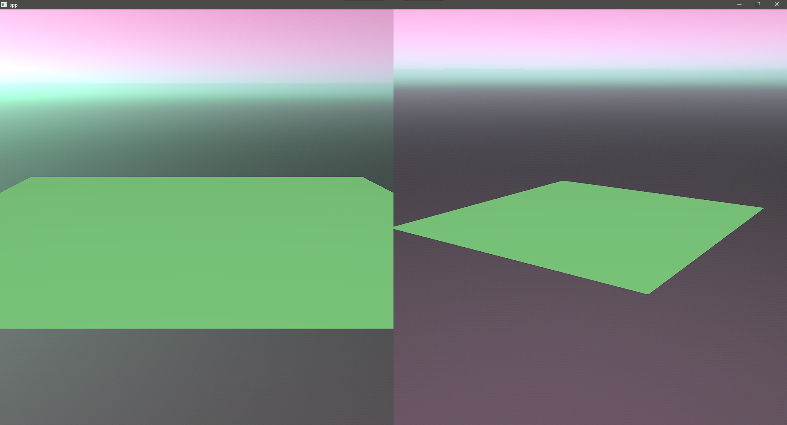
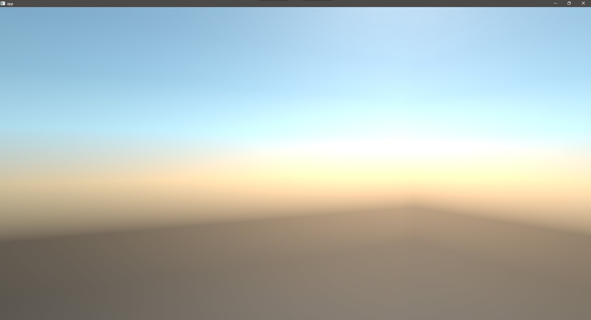

# examples

## [atmosphere.rs](atmosphere.rs)

Demonstrates using `Atmosphere` to update the sky simulation. Use the number keys to switch presets. (The above is Preset 2)

## [basic.rs](basic.rs)

The most simple usage of bevy_atmosphere. It uses the default `Atmosphere`, which has Earth-like parameters. Feel free to copy it as a template!

## [cycle.rs](cycle.rs)

A daylight cycle in the default `ATmosphere`, updating every 50ms.

## [detection.rs](detection.rs)

Demonstrates adding and removing the skybox with the `detection` feature. Use `LMouse` to add and `RMouse` to remove.

## [splitscreen.rs](splitscreen.rs)

A split-screen application, demonstrating the flexibility for local multiplayer games. Uses a custom `Atmosphere` to change the sky color.

## [settings.rs](settings.rs)

Demonstrates using `AtmosphereSettings` to update the resolution on the fly, similar to how an in-game quality settings menu could operate. Use the number keys to switch presets.
